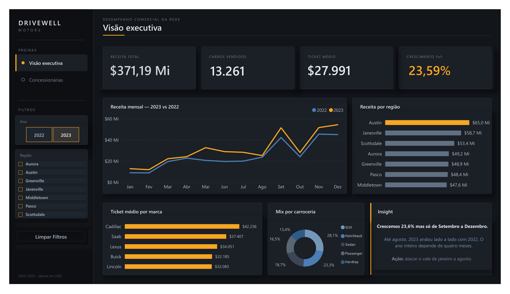
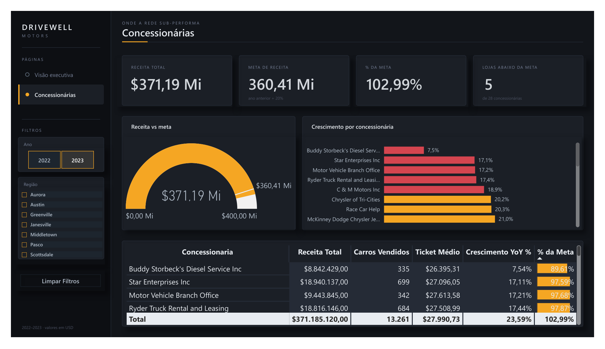

# 🚗 DriveWell Motors — Análise de Performance Comercial

Dashboard de vendas para uma rede de concessionárias multi-regional. Descobri que o crescimento anunciado de 23,6% era enganoso — e que o problema da rede não era regional, era de uma loja específica.


**🔗 [Ver dashboard ao vivo]([https://app.powerbi.com/view?r=eyJrIjoiMGZiYzBlNWItNzBlNi00OTVhLTk4ZDgtOGMxNDI0MmQwYzdmIiwidCI6ImU4MmU1OWEwLWY0YTAtNDNmMC1iM2E5LTIwMDZjNjdmMGQ2NiJ9](https://app.powerbi.com/view?r=eyJrIjoiNjE4ZWU3MTUtMzdlOS00ZmMxLWFlYTMtMjcxNGExNWE4ZGYyIiwidCI6ImU4MmU1OWEwLWY0YTAtNDNmMC1iM2E5LTIwMDZjNjdmMGQ2NiJ9))** · publicado no Power BI Service
---

## Preview




---

## Os achados

**1. O crescimento de 23,6% veio quase todo de quatro meses.**
De janeiro a agosto, 2023 rodou praticamente no mesmo patamar de 2022. Todo o ganho se concentrou entre setembro e dezembro. A rede não cresceu — ela teve um fim de ano melhor, e ficou *mais* dependente dele.
→ **E daí:** o plano comercial precisa atacar o vale de jan–ago, não celebrar o número anual.

**2. Quem mais vende não é quem mais fatura por carro.**
Chevrolet, Ford e Dodge lideram a receita por volume, com ticket de ~$26 mil. Cadillac, Saab e Lexus operam acima de $34 mil — 40% acima da média da rede — e ninguém as gerencia como linha separada.
→ **E daí:** existe um segmento premium dentro da rede que hoje é tratado igual ao resto.

**3. A sub-performance não é regional. É de loja.**
Todas as sete regiões cresceram entre 20,2% e 25,5% — amplitude de apenas 5,3 pontos. Já entre as 28 concessionárias, a amplitude é de **25 pontos**: de +32,4% a +7,5%.
Cinco lojas ficaram abaixo da meta. Quatro delas por pouco (17% a 19%). Uma está quebrada: **Buddy Storbeck's cresceu 7,5% — 16 pontos abaixo da rede.**
→ **E daí:** não convoque cinco gerentes. Convoque um.

---

## O que caiu (e por que isso importa)

Testei quatro hipóteses de segmentação. **Todas falharam** — e a documentação delas é parte do trabalho, não uma nota de rodapé.

| Hipótese | Método | Resultado |
|---|---|---|
| Renda prevê o preço do carro | Faixas, Pearson, decis | **Correlação 0,0121.** Nenhuma. |
| Gênero segmenta o ticket | Dispersão entre categorias | 0,8% — ruído |
| Transmissão segmenta o ticket | Dispersão entre categorias | 1,2% — ruído |
| Cor segmenta o ticket | Dispersão entre categorias | 4,6% — fraco demais |

A hipótese da renda era a espinha de uma **página inteira** do dashboard. Testei com três métodos independentes (faixas de quartil, correlação de Pearson, e decis) e o sinal simplesmente não existe: o ticket médio varia 1,4% entre a faixa mais pobre e a mais rica.

Descobri também que **22% dos registros de renda têm o valor idêntico de 13.500** — assinatura clássica de dado sintético gerado sem lógica de negócio.

**Cortei a página.** O dashboard tem duas páginas em vez de três. Uma página bonita provando que não há nada ali não é entrega — é enchimento.

Detalhes em [`docs/06-decisoes-e-aprendizados.md`](docs/06-decisoes-e-aprendizados.md).

---

## O problema

A DriveWell Motors é uma rede fictícia de concessionárias operando em sete regiões dos EUA, construída sobre o dataset real *Car Sales Report* (Kaggle). O Gerente Comercial encomendou um painel para responder duas perguntas:

- **Onde está o crescimento da receita?** (região, marca, tempo)
- **Onde a rede sub-performa?**

O contrato exigia mais que gráficos: exigia uma recomendação de negócio defensável em cinco minutos de apresentação.

---

## Perguntas de negócio

1. A receita cresceu em 2023? Quanto, e distribuído como ao longo do ano?
2. Qual região puxa o faturamento — e qual ficou para trás?
3. Volume de vendas e faturamento andam juntos, ou existem marcas que vendem pouco e faturam muito?
4. Quais concessionárias estão abaixo de uma meta de crescimento razoável?
5. O perfil do cliente (renda, gênero) prevê o valor da compra?

*(A pergunta 5 foi respondida com um "não" — ver seção acima.)*

---

## Stack e processo

**Excel** → limpeza no Power Query, EDA com tabelas dinâmicas, validação com fórmulas
**Power BI** → modelo estrela, DAX, dashboard de duas páginas
**Design** → sistema visual próprio, planos de fundo em SVG/PNG

O Excel não está neste repositório como arquivo. Ele foi a **fase de descoberta** — e o que importa dela são as decisões, não o `.xlsx`. Estão documentadas em [`docs/02-dados-e-profiling.md`](docs/02-dados-e-profiling.md) e [`docs/03-etl-e-modelagem.md`](docs/03-etl-e-modelagem.md).

Todos os números do Power BI foram **validados contra o Excel**. Receita total: `$671.525.465`. Carros: `23.906`. Crescimento 2023: `+23,6%`. Se não batesse, o erro estaria no modelo.

---

## Estrutura do repositório

```
├── README.md
├── docs/
│   ├── 01-contexto.md                  o briefing e a tese
│   ├── 02-dados-e-profiling.md         o dataset e o que estava quebrado nele
│   ├── 03-etl-e-modelagem.md           Power Query, star schema, o bug da dimensão
│   ├── 04-medidas-dax.md               as 8 medidas, uma a uma, com a decisão por trás
│   ├── 05-analise.md                   os achados e como cheguei neles
│   └── 06-decisoes-e-aprendizados.md   o que caiu, os tropeços, o que eu faria diferente
├── powerbi/
│   └── Análise de Vendas — DriveWell Motors.pbix
└── assets/
    ├── pagina-1-visao-executiva.png
    ├── pagina-2-concessionarias.png
    └── backgrounds/                    os planos de fundo do dashboard
```

---

## Limitações

**O dataset é sintético em partes.** A coluna de renda tem 22% de valores idênticos e correlação zero com o preço. Não é possível afirmar que a ausência de sinal reflete comportamento real de mercado — provavelmente reflete apenas como o dado foi gerado. Tratei isso como limitação declarada, não como achado de negócio.

**A meta de +20% é uma premissa minha.** Não existe meta na base. Escolhi 20% porque é exigente (a rede cresceu 23,6%), redondo e separa bem — cinco lojas ficam abaixo. Uma meta que ninguém erra não é meta. Mas é uma escolha, não um dado.

**"Concessionária" e "região" são dimensões independentes.** Descobri que todas as 28 lojas vendem em todas as 7 regiões — não existe hierarquia geográfica real, o que é implausível no mundo físico. É uma característica do dataset, e ela limita qualquer análise territorial mais profunda.

**Sem dados de custo ou margem.** Toda análise é de receita. "Ticket médio alto" não significa "mais lucrativo".

---

## Autor

**Lucas Souza Fontes Caminha**
[LinkedIn — preencher] · [GitHub — preencher]
